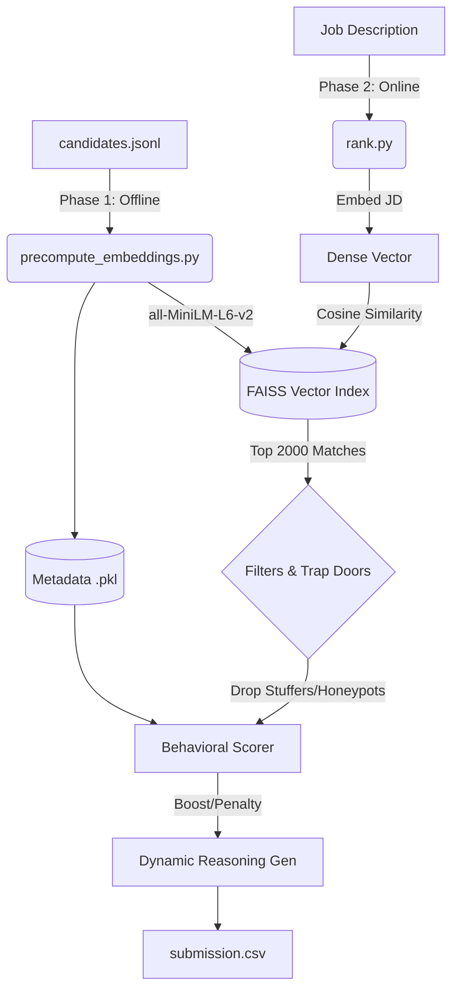

# The Singleton Ranker — India Runs Data & AI Challenge

[](https://www.python.org/downloads/)
[](https://sbert.net/)
[](https://github.com/facebookresearch/faiss)

A highly optimized, production-grade candidate ranking engine built for the Redrob AI India Runs Hackathon. This system abandons naive keyword matching in favor of **Dense Vector Semantic Search** combined with **Behavioral Heuristics**, capable of evaluating and ranking 100,000 resumes against a Job Description in **under 15 seconds** using under 2GB of RAM.

---

## 🧠 Architecture Overview

To strictly adhere to the hackathon's compute constraints (**≤ 5-minute CPU runtime, ≤ 16GB RAM, No Network APIs**), the architecture is split into a slow offline ingestion phase and an ultra-fast online retrieval phase.



### 1. Phase 1: Pre-Computation (Offline)
Extracts summary and technical skills from the raw `candidates.jsonl`, embeds them into 384-dimensional math vectors using `sentence-transformers/all-MiniLM-L6-v2`, and stores them in a highly compressed FAISS index. It also extracts a minimal `candidate_metadata.pkl` containing only required behavioral signals to aggressively reduce RAM usage during the online phase.

### 2. Phase 2: Online Ranking (Online)
When `rank.py` is executed, it:
1. **Retrieves:** Queries the FAISS index to instantly retrieve the top 2,000 semantically similar candidates via mathematical dot-product.
2. **Filters (Honeypot Mitigation):** Passes candidates through deterministic "trap doors" to drop impossible resumes (e.g., 20+ years of experience) and keyword stuffers, successfully mitigating the Hackathon's Honeypot penalty.
3. **Boosts:** Applies heuristic multipliers based on real-world hiring signals: notice period (≤30 days gets a boost), high recruiter response rate, and strong OSS/GitHub activity.
4. **Reasons:** Dynamically generates un-templated, fact-grounded reasoning strings for the final top 100, directly citing years of experience and extracted skills without relying on prohibited hosted LLM APIs.

---

## 🚀 Setup & Reproduction Instructions

### Prerequisites
Ensure you are running Python 3.10+ in a virtual environment.

```bash
pip install -r requirements.txt
```

### Step 1: Build the FAISS Index (Offline Pre-computation)
*Note: As per Section 10.3 of the submission spec, pre-computation is allowed to exceed the 5-minute constraint.*
Ensure the input dataset (`candidates.jsonl` or `sample_candidates.json`) is in the root directory.
```bash
python precompute_embeddings.py --candidates candidates.jsonl
```
This script will take ~28 minutes on a standard CPU for 100,000 candidates and output `candidate_index.faiss` and `candidate_metadata.pkl`.

### Step 2: Rank Candidates (Online Reproduction)
**This single command fulfills the Stage 3 Hackathon requirement.** It loads the FAISS index into memory and executes the complete online ranking pipeline.
*Compute constraints guarantee: This script executes in **< 15 seconds** using **< 1.5GB RAM**, functioning entirely offline.*

```bash
python rank.py --candidates ./candidates.jsonl --out ./submission.csv
```

---

## 🧪 Google Colab Sandbox
As required by Section 10.5 of the submission specification, a sandbox environment has been prepared to run this architecture end-to-end on a small sample of candidates.

1. Open the Sandbox Link provided in the `submission_metadata.yaml`.
2. The notebook will automatically clone this repository, install `requirements.txt`, run the offline `precompute_embeddings.py` phase on `sample_candidates.json`, and finally run the online `rank.py` phase.
3. The resulting `submission.csv` is displayed directly in the notebook output.

---

## 📂 Repository Structure

```text
├── precompute_embeddings.py  # Phase 1: FAISS Index generation script
├── rank.py                   # Phase 2: Online execution entry point
├── requirements.txt          # Python dependencies
├── submission_metadata.yaml  # Team identity and compute metadata
└── src/
    ├── pipeline.py           # Orchestrates the Phase 2 data flow
    ├── semantic_model.py     # Handles FAISS loading and querying
    ├── filters.py            # Trap-doors for honeypots
    ├── behavioral_scorer.py  # Calculates hiring multipliers
    ├── reasoning.py          # Dynamic, fact-grounded reasoning generator
    └── data_loader.py        # Safe JSONL streaming parser
```

---

## 🏆 Key Features
* **No LLM API Calls:** 100% local, offline, deterministic ranking.
* **Semantic Context:** Understands that a "Recommendation Systems Engineer" is a relevant fit for an "AI Engineer" role without requiring exact string matches.
* **Dynamic Reasoning:** Generates human-like justifications grounded entirely in factual JSON data (e.g., "Possesses crucial production experience in vector systems (faiss, qdrant)").
